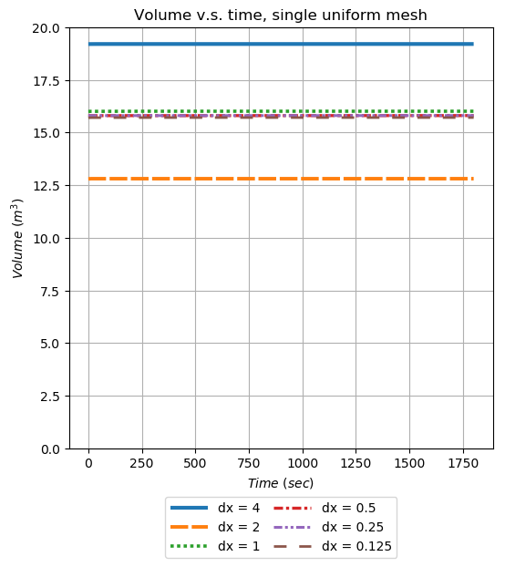
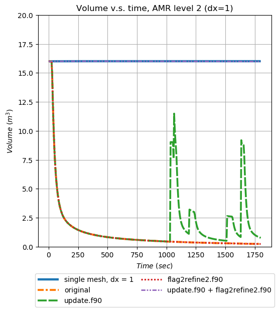

geoclaw-neck-test
=================

This repository includes all necessary components for reproducing neck-test with
GeoClaw v5.5.0. The neck-test is a set of tests to show that the possible 
non-conservative behavior of GeoClaw when the base topography has a neck-like 
(or channel-like) feature.

-----------------------------
## 1. Steps to reproduce results

To reporduce the results, follow these commands (on Linux):

```
$ python setup.py
$ python run.py
$ python totalvolume.py
$ python create_plots.py
```

The followings are the dependencies required. The versions of these dependencies 
are the ones I used. It doesn't mean other versions do not work. It's just saying 
I don't know what will happen if other versions are used.

1. gfortran 8
2. python 3.6.8
3. numpy 1.15.4
4. matplotlib 3.0.2

My test environment is Arch Linux with kernel 5.0.0-arch1-1-ARCH.

----------
## 2. Results

### 2.1. Using a single-level mesh for a simulation

#### 2.1.1. dx = 4


#### 2.1.2. dx = 2


#### 2.1.3. dx = 1


#### 2.1.4. dx = 0.5


#### 2.1.5. dx = 0.25


#### 2.1.6. dx = 0.125


### 2.2. Using a two-level AMR mesh for a simulation (coarse grid: dx=4; fine mesh: dx=1)

#### 2.2.1. Original GeoClaw

*Depth on the level 1 grid*


*Depth on the level 2 grid*


#### 2.2.2. Modified `update.f90`

*Depth on the level 1 grid*


*Depth on the level 2 grid*


#### 2.2.3. Modified `flag2refine2.f90`

*Depth on the level 1 grid*


*Depth on the level 2 grid*


#### 2.2.4. Modified `update.f90` + modified `flag2refine2.f90`

*Depth on the level 1 grid*


*Depth on the level 2 grid*


### 2.3. Conservation of fluid volumes

*Volume conservation of the single-level mesh cases*



*Volume conservation of the two-level AMR mesh cases: level 1*


*Volume conservation of the two-level AMR mesh cases: level 2*



----------
## 3. Contact

Pi-Yueh Chuang pychuang@gwu.edu
