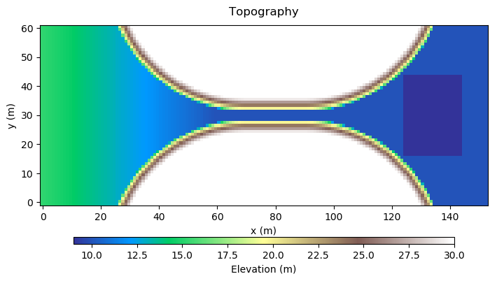
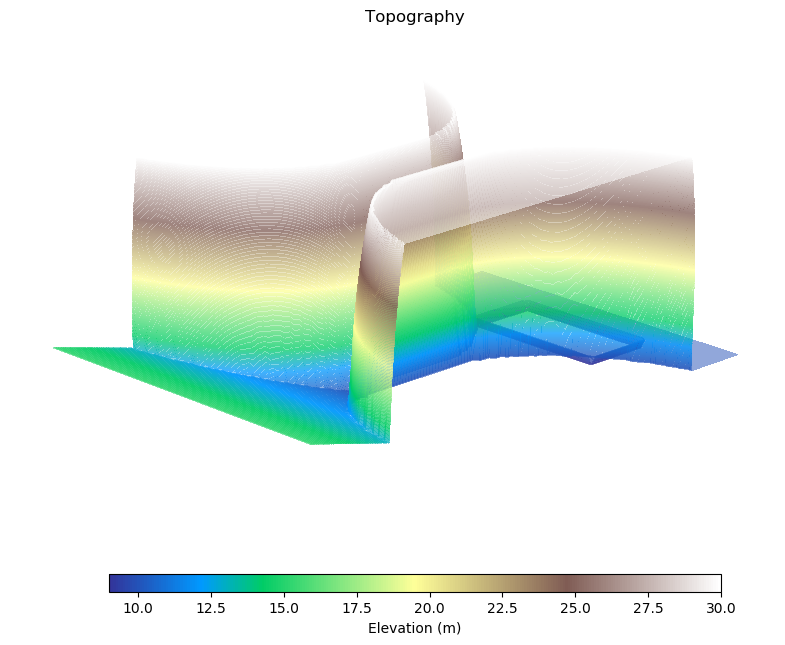

geoclaw-neck-test
=================

This repository includes all necessary components for reproducing neck-test with
GeoClaw v5.5.0. The neck-test is a set of tests to show that the possible 
non-conservative behavior of GeoClaw when the base topography has a neck-like 
(or channel-like) feature.

-----------------------------
## 1. Steps to reproduce results

To reporduce the results, follow these commands (on Linux):

```
$ python setup.py
$ python run.py
$ python totalvolume.py
$ python create_plots.py
```

The followings are the dependencies required. The versions of these dependencies 
are the ones I used. It doesn't mean other versions do not work. It's just saying 
I don't know what will happen if other versions are used.

1. gfortran 8
2. python 3.6.8
3. numpy 1.15.4
4. matplotlib 3.0.2

My test environment is Arch Linux with kernel 5.0.0-arch1-1-ARCH.

----------------
## 2. Input data

### 2.1. Topography

The topography is a made-up. Its spatial resolution is 1m by 1m. The inflow 
region is an inclined flat surface with an angle of 5 degree. The inclined
region spans from x=0 to x=60m. This provides required gravity to drive the flow.
A channel with a converging entrance and a diverging exit is in the middle 
of the whole topography. And it begins from approximately x=21.5m to x=138.5m. 
The width of the moddle section of the channel is 3m. Part of the channel 
entrance is located in the inclined region, while its middle and rear sections 
are at horizontal level. There is a pool-like feature after the exit of the 
channel. The purpose of the pool is to collect the fluid, and hence the flow 
will not touch the computational boundaries. This should eliminate the effect 
of boundary conditions.

The topgraphy data will be created when the `setup.py` script is executed. To
create 2D and 3D plots of the topography, after executing `setup.py`, execute
`$ python plot_topo.py`.

*2D plot of the topography*


*3D plot of the topography*


### 2.2. Initial condition (I.C.)

The initial state of the flow is at a cylinder-like shape. The cylinder is 
centered at x=20m and y=30m with a radius of 5m and a depth of 0.2m. 
Theoretically, the initial volume is about 15.708 cubic meters. However, when 
applying this I.C. to computational grids, we use a very naive algorithm: only 
the cells that have their centers enclosed by the 5m radius will have initial 
values. The consequence is that the initial volumes of the fluid depend on the 
grid resolutions and are not exactly 5 x 5 x 0.2 x pi. Given that the purpose of
this series of tests is to test the AMR capability of channel-like (neck-like)
features, it may not be necessary to improve the initial condition setup.

### 2.3. Other parameters

1. Sea level: -10.0 m
2. Dry tolerance 1e-4 m
3. Manning's friction coefficient: 0.035
4. Friction depth: 1e6 m
5. Variable dt refinement: True

----------
## 3. Results

### 3.1. Using a single-level mesh for a simulation

#### 3.1.1. dx = 4


#### 3.1.2. dx = 2


#### 3.1.3. dx = 1


#### 3.1.4. dx = 0.5


#### 3.1.5. dx = 0.25


#### 3.1.6. dx = 0.125


### 3.2. Using a two-level AMR mesh for a simulation (coarse grid: dx=4; fine mesh: dx=1)

#### 3.2.1. Original GeoClaw

*Depth on the level 1 grid*


*Depth on the level 2 grid*


#### 3.2.2. Modified `update.f90`

*Depth on the level 1 grid*


*Depth on the level 2 grid*


#### 3.2.3. Modified `flag2refine2.f90`

*Depth on the level 1 grid*


*Depth on the level 2 grid*


#### 3.2.4. Modified `update.f90` + modified `flag2refine2.f90`

*Depth on the level 1 grid*


*Depth on the level 2 grid*


### 3.3. Conservation of fluid volumes

*Volume conservation of the single-level mesh cases*


*Volume conservation of the two-level AMR mesh cases: level 1*


*Volume conservation of the two-level AMR mesh cases: level 2*


----------
## 4. Contact

Pi-Yueh Chuang pychuang@gwu.edu
